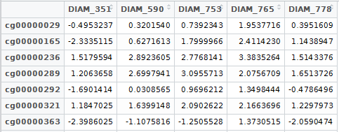

The package methXGB contains trained XGBoost models [@xgboost] that can be used to infer tumour purity and extent of immune infiltrate (immunescore) in the DNA methylation data from tumour samples analyzed with Illumina’s 450k and EPIC microarrays.

# Introduction
A machine learning framework to infer biological variables in DNA methylation data from Illumina 450K and EPC arrays from different cancer types.
The methXGB package contains machine learning models based on the XGBoost algorithm, that can be used interpret DNA methylation data from different cancer types.
The XGBoost models were trained using DNA methylation data expressed as M-values. Nonetheless, the package also accepts beta-values as input (converted internally).

# Installation
The package methXGB is distributed through Bioconductor, and the standard method to install its packages apply.
```{r installation,eval=FALSE}
install.packages("BiocManager")
BiocManager::install("methXGB")
```

# Load Data
The methXGB package takes as input a data frame containing M-values, where the column names correspond to the sample identifiers and where each row name is an Illumina probe ID.
To load the example data included in the package:

```{r load_data_example,eval=FALSE}
library(methXGB)
data(mvalGBM)
view(mvalGBM) #in RStudio, a screenshot of the top 7 rows is provided below
```


A typical workflow starts with the idat files being processed with the minfi package [@minfi] for normalization (i.e. Illumina method) and extraction of M-values.
We recommend the use of native save and load functions to store and retrieve data frames containing M-values.
At the end of a minfi workflow, store the M-values in a data frame called "mval", column names samples and row names Illumina probe IDs.
```{r load_data,eval=FALSE}
save(mval, file="M_myCancerStudy.RData")
To load the data frame:
load(file="M_myCancerStudy.RData")
```
the data frame named "mval" is loaded into the workspace
Beta-values can be transformed into M-values as follows:
beta.values is a data frame where column names are sample names and row names Illumina probe IDs.
```{r betaToMval_transform,eval=FALSE}
mval<-betaToMval(beta.values)
```
This transformation is described in the paper xxx [@mval_beta].


## M-values extraction from microarray data (idat files)
The methXGB package incorporates methods to produce readily usable M-values from raw microarray data (idat files). This workflow uses GEOquery to fetch DNA methylation data from the Gene Expression Omnibus, and minfi to normalize the microarray data with the Illumina method, followed by M-value extraction.
```{r process_idat,eval=FALSE}
idatParse(in="GSE60274",task=”GEOquery”) #downloads and extracts idats
idatParse(in="GSE60274",task=”generate_samplesheet”)
idatParse(in=”GSE60274”,task=”extract_mval”)
#This results in a file called M_ GSE60274.RData.

#output of the last process (summary)
#Finally, to load the data frame mval contained in the RData file:
load(file="M_myCancerStudy.RData")
```

The `idatParse()` functon is designed to provide users readily access to data in M-values format, but it is not a replacement for cumstom-built minfi workflows.

# Estimation of biological variables in DNA methylation data
Different models (families) have been trained. 
To view the models that are included in the package:
 (displays model_summary.txt)
methXGB.summary()
Family: purity
Description: ….
Family: immunescore
Description: …
For family-level details, use methXGB.summary(family=”…”)

## Infer tumour purity
```{r infer_tumour_purity_summary,eval=FALSE}
methXGB.summary(family=”purity”)
```
Something goes here…Absolute??
To infer the tumour purity in DNA methylation data:

```{r predict_purity,eval=FALSE}
pred.purity<-methXGB.pred(m.values=mval, model.family="tumour_purity",training.set="TCGA-LGG")
```

## Infer immunescore
The following XGBoost models were trained using the TCGA 450k data from different tumour types, and ESTIMATE immunescore [@estimate] which was derived from an mRNA expression pan-cancer signature. See the ESTIMATE paper for details. Only tumour types with more than 100 with 450 data and ESTIMATE.immunescore (RNA-seq_v2).
```{r predict_immunescore_summary,eval=FALSE}
methXGB.summary(family=”immunescore”)
```

To infer the immunescore in DNA methylation data:
```{r predict_immunescore,eval=FALSE}
pred.immunefscore<-methXGB.pred(m.values=mval, model.family="immunescore",training.set="TCGA-LGG")
```

# Dataset-level result cross-validation
We have included a cross-validation method that employs a different methodology.
There are situations were we want to obtain validity of the results. This can be applied to situations were a tumour type of interest was not trained due to limited data availability. 


# Session info {.unnumbered}

Output of `sessionInfo()`:

```{r sessionInfo, echo=FALSE}
sessionInfo()
```


# The trunk... {.unnumbered}
Let's see what happens... [@minfi].
Let's see what happens... [@mval_beta].
Let's see what happens... [@xgboost].
Let's see what happens... [@estimate].


```{r echo=FALSE, results='asis'}
library(knitr)
kable(mtcars[1:5,], caption="A knitr kable")

```

# References


